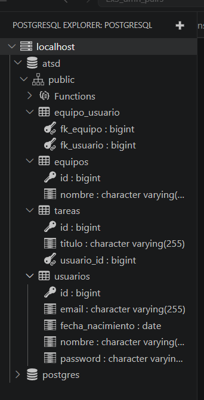

# README TDD - Exercise 3

## Release version

This documentation corresponds to release version `1.2.0`.

The objective of this version is to add the team membership functionality to the original ToDoList application and to document the development process followed in the project.

---

## Implemented user story

### 009 Manage Team Membership

The implemented user story allows the user to manage their membership in teams.

The functionality added in this version allows:

* Listing the available teams.
* Creating a new team.
* Viewing the detail page of a team.
* Seeing the users that belong to a team.
* Joining a team.
* Leaving a team.
* Allowing one user to belong to more than one team.
* Allowing one team to contain many users.

This functionality was implemented using a many-to-many relationship between users and teams.

---

## Trello and GitHub methodology

For this exercise we followed an agile workflow using Trello and GitHub.

The objective was to organize the development of version `1.2.0` of the application in small tasks, connect each task with a GitHub issue, develop each change in a separate branch, and finally merge the work through pull requests after the tests passed successfully.

First, the work was divided into user stories. Each user story represented a functionality that the user should be able to use in the application.

For example, the team functionality was divided into tasks related to:

* Service and repository layer.
* Controller and view layer.
* Team membership.
* Documentation.
* PostgreSQL configuration.
* GitHub Actions workflows.

These user stories were added to the Trello board so that the development progress could be followed visually.

The Trello board was organized with the following columns:

| Column          | Meaning                                    |
| --------------- | ------------------------------------------ |
| To Do           | Tasks that still had to be developed       |
| Doing           | Tasks currently being implemented          |
| In Pull Request | Tasks implemented and waiting to be merged |
| Done            | Tasks already merged and finished          |

At the beginning, each task or user story was placed in the **To Do** column.

When we started working on one of them, the card was moved to **Doing**.

Once the implementation was finished and a pull request was created on GitHub, the Trello card was moved to **In Pull Request**.

Finally, after the pull request was reviewed, the tests passed, and the branch was merged into `main`, the card was moved to **Done**.

---

## GitHub methodology

Each Trello card was related to a GitHub issue.

The issues were used to describe the technical work needed to complete each user story. The issue title started with a number, following the methodology required in the exercise.

Examples of issues used in the project:

* `008 Service and model teams listing`
* `009 Manage team membership`
* `010 View and controller teams listing`
* `011 Documentation and release version`

For every issue, a new Git branch was created. The branch name was related to the functionality being implemented.

The development process followed this order:

1. Create or choose a Trello card for the user story.
2. Create a GitHub issue linked to that user story.
3. Assign the issue to milestone `1.2.0`.
4. Create a new branch from `main`.
5. Implement the necessary changes in the code.
6. Commit the changes with a clear message.
7. Push the branch to GitHub.
8. Open a pull request from the branch into `main`.
9. Link the pull request to the corresponding issue.
10. Wait for GitHub Actions to run the tests.
11. If the developer tests and integration tests passed, merge the pull request.
12. Move the Trello card to **Done**.

This methodology was applied to the different layers of the application.

First, the model and repository layer was implemented. This included creating the `Equipo` entity, the `EquipoRepository`, and the many-to-many relationship between `Equipo` and `Usuario`.

Then, the service layer was implemented, adding the business logic needed to create teams, list teams, join a team, leave a team, and obtain the users of a team.

Finally, the controller and view layer was implemented, adding the endpoints and Thymeleaf templates needed to use the functionality from the web interface.

---

## GitHub Actions workflows

The repository uses two GitHub Actions workflows.

| Workflow          | Explanation                                                     |
| ----------------- | --------------------------------------------------------------- |
| Developer tests   | Runs the Maven tests using the normal development configuration |
| Integration tests | Runs the tests using a PostgreSQL database container            |

The developer test workflow is used to check that the project works correctly during normal development.

The integration test workflow is used to check that the project can connect to a PostgreSQL database and that the database profile works correctly.

Before merging a pull request, both workflows should pass successfully. This helps to make sure that new code does not break the existing functionality.

---

## Endpoints

The team functionality adds the following endpoints:

| Method | Endpoint              | Description                                                       |
| ------ | --------------------- | ----------------------------------------------------------------- |
| GET    | `/equipos`            | Shows the list of teams                                           |
| GET    | `/equipos/{id}`       | Shows the detail page of one team and the users that belong to it |
| POST   | `/equipos/nuevo`      | Creates a new team                                                |
| POST   | `/equipos/{id}/join`  | Adds the logged user to a team                                    |
| POST   | `/equipos/{id}/leave` | Removes the logged user from a team                               |

These endpoints are used by the Thymeleaf templates to allow the user to interact with the team functionality from the web interface.

---

## Classes added or modified

| Class              | Layer      | Explanation                                                            |
| ------------------ | ---------- | ---------------------------------------------------------------------- |
| `Equipo`           | Model      | Entity that represents a team in the application                       |
| `Usuario`          | Model      | Modified to include the many-to-many relationship with teams           |
| `EquipoRepository` | Repository | Repository used to save, search and recover teams from the database    |
| `EquipoService`    | Service    | Contains the business logic for creating teams and managing membership |
| `EquipoController` | Controller | Controller that manages the team pages and membership actions          |
| `EquipoData`       | DTO        | Data Transfer Object used to send team data to the views               |

---

## Database tables

The application uses a relational database to store users, tasks and teams.

For this exercise, the most important new tables are related to the team functionality.

### `usuarios`

The `usuarios` table stores the users of the application.

Each user has an identifier and information such as their email and name.

Users are necessary because the team functionality allows each logged-in user to join or leave different teams.

### `tareas`

The `tareas` table stores the tasks created by users.

This table already existed in the original ToDoList application.

Each task is associated with a user, so the application can show the tasks that belong to the logged-in user.

### `equipos`

The `equipos` table stores the teams created in the application.

Each team has an identifier and a name.

This table was added for the team management functionality. It allows the application to save the list of available teams and later show them in the teams page.

### `equipo_usuario`

The `equipo_usuario` table is an intermediate table used to represent the many-to-many relationship between users and teams.

A user can belong to more than one team, and a team can contain many users.

Because of that, the relationship cannot be stored only inside the `usuarios` table or only inside the `equipos` table.

This table stores pairs of identifiers:

* One column references the team.
* One column references the user.

For example, if user `1` belongs to team `3`, the table stores a row connecting that user with that team.

This structure makes it possible to:

* List all teams of a user.
* List all users of a team.
* Add a user to a team.
* Remove a user from a team.
* Allow the same user to participate in several teams.

The database tables were generated automatically by JPA/Hibernate from the entity classes and their annotations.

The `Equipo` entity created the `equipos` table, the `Usuario` entity created the `usuarios` table, and the many-to-many relationship between both entities created the `equipo_usuario` table.

### Screenshot of the database tables

The following screenshot shows the database tables generated by the application:



---

## Tests explained

The project includes developer tests and integration tests.

The developer tests are executed with Maven during local development.

The integration tests are executed with GitHub Actions using a PostgreSQL database container.

This allows the project to check that the code works both in the normal development environment and with the real PostgreSQL database configuration.

### Equipo entity test

The first test checks the creation of the `Equipo` class.

The objective is to verify that a team can be created with a name and that the name can be recovered correctly using the getter method.

This is the first step of the TDD process because the test is written before implementing the minimum code needed in the `Equipo` class.

### Equipo repository test

The repository test checks that a team can be saved in the database and later recovered.

In this test, a new `Equipo` object is created and saved using `EquipoRepository`.

After saving it, the test checks that the team has received an identifier and that it can be found again using `findById`.

This test verifies that the `Equipo` entity is correctly connected to JPA and that the `equipos` table is generated and used correctly.

### Equality test between teams

Another test checks the `equals` and `hashCode` methods of the `Equipo` class.

This is important because teams may be compared in collections or when working with relationships.

The equality logic checks the team identifier when it exists.

If the identifier does not exist yet, the comparison is based on the team name.

This avoids problems when comparing teams that are already stored in the database and teams that are still temporary objects.

### Many-to-many relationship test

The many-to-many relationship test checks the relationship between `Equipo` and `Usuario`.

The test creates a team and a user, saves them in the database, and then adds the user to the team.

After that, the test verifies that:

* The team contains the user.
* The user contains the team.
* The relationship is correctly updated on both sides.

This test is important because the application needs to allow users to join teams and leave teams.

It also verifies that the intermediate table `equipo_usuario` works correctly.

### EquipoService tests

The service tests check the business logic of the team functionality.

These tests are used to verify that the service layer works correctly before connecting it to the controller and views.

The service tests check operations such as:

* Creating a new team.
* Listing teams.
* Ordering teams alphabetically.
* Adding a user to a team.
* Removing a user from a team.
* Obtaining the users that belong to a team.
* Detecting error cases, such as trying to join a team that does not exist.
* Detecting error cases, such as trying to remove a user from a team incorrectly.

These tests are important because the controller should not contain complex logic.

The controller should only call the service methods.

Therefore, most of the important functionality is tested in the service layer.

### Web/controller tests

The web tests check that the controller endpoints work correctly.

They verify that the correct pages are loaded, that the model contains the necessary data, and that the user can access the team functionality from the web interface.

For the team functionality, the web layer includes endpoints such as:

* Showing the list of teams.
* Showing the users of a selected team.
* Creating a new team.
* Joining a team.
* Leaving a team.

---

## Thymeleaf templates

The following Thymeleaf templates were added or modified for the team functionality:

| Template             | Explanation                                                                       |
| -------------------- | --------------------------------------------------------------------------------- |
| `listaEquipos.html`  | Shows the list of teams. From this page, the logged user can join or leave a team |
| `detalleEquipo.html` | Shows the detail page of one team and the users that belong to it                 |
| `fragments.html`     | Contains the navigation bar. It was modified to include the Teams option          |

### `listaEquipos.html`

This template displays the available teams.

It allows the user to see the list of teams stored in the database.

It also includes the buttons needed to join or leave a team.

### `detalleEquipo.html`

This template displays the information of a selected team.

It also shows the users that belong to that team.

This is useful to check that the many-to-many relationship between users and teams is working correctly.

### `fragments.html`

This template contains common parts of the layout, especially the navigation bar.

It was modified to include a link to the Teams section.

Thanks to this change, the user can access the team functionality from the navbar.

---

## Remarkable code added

### Many-to-many relationship between users and teams

The most important change in the model layer is the many-to-many relationship between `Usuario` and `Equipo`.

This relationship is necessary because:

* One user can belong to several teams.
* One team can contain several users.

This relationship creates the intermediate table `equipo_usuario`.

### EquipoService

The `EquipoService` class contains the business logic of the team functionality.

The controller does not directly modify the database.

Instead, the controller calls the service methods.

This keeps the application organized and separates the web layer from the business logic.

The service layer includes methods for:

* Creating teams.
* Listing teams.
* Joining a team.
* Leaving a team.
* Getting the users of a team.

### EquipoController

The `EquipoController` class manages the web requests related to teams.

It connects the Thymeleaf templates with the service layer.

The controller contains the endpoints used to show the team list, show a team detail page, create a team, join a team, and leave a team.

### PostgreSQL profile

A PostgreSQL profile was added so that the application can be executed using a PostgreSQL database instead of the default development database.

The profile is configured in:

```text
src/main/resources/application-postgres.properties
```

This profile is used by the integration tests and can also be used locally with Docker.

---

## Docker commands

### Download PostgreSQL image

```bash
docker pull postgres:13
```

### Run PostgreSQL development container

```bash
docker run -d \
  -p 5432:5432 \
  --name postgres-develop \
  -e POSTGRES_USER=atsd \
  -e POSTGRES_PASSWORD=atsd \
  -e POSTGRES_DB=atsd \
  postgres:13
```

### Run PostgreSQL test container

```bash
docker run -d \
  -p 5432:5432 \
  --name postgres-test \
  -e POSTGRES_USER=atsd \
  -e POSTGRES_PASSWORD=atsd \
  -e POSTGRES_DB=atsd_test \
  postgres:13
```

### Check running containers

```bash
docker container ls -a
```

### Stop PostgreSQL container

```bash
docker container stop postgres-develop
```

### Start PostgreSQL container again

```bash
docker container start postgres-develop
```

### Check PostgreSQL logs

```bash
docker container logs postgres-develop
```

### Run the application with PostgreSQL profile

```bash
mvn spring-boot:run -Dspring-boot.run.profiles=postgres
```

---

## Docker image

Docker Hub image:

```text
jamesbobbrown/atsd-todolist-james-misha:1.2.0
```

Docker Hub link:

```text
https://hub.docker.com/r/jamesbobbrown/atsd-todolist-james-misha
```

### Build Docker image

```bash
docker build -t jamesbobbrown/atsd-todolist-james-misha:1.2.0 .
```

### Push Docker image

```bash
docker push jamesbobbrown/atsd-todolist-james-misha:1.2.0
```

### Run application Docker image

```bash
docker run --rm \
  -p 8081:8080 \
  --name todolist-app \
  -e SPRING_PROFILES_ACTIVE=postgres \
  -e POSTGRES_HOST=host.docker.internal \
  -e POSTGRES_PORT=5432 \
  -e POSTGRES_DB=atsd \
  -e DB_USER=atsd \
  -e DB_PASSWORD=atsd \
  jamesbobbrown/atsd-todolist-james-misha:1.2.0
```

---

## Conclusion

Version `1.2.0` adds the team membership functionality to the application.

The work was organized using Trello, GitHub issues, branches, pull requests, milestones and GitHub Actions.

The implementation includes changes in the model, repository, service, controller and view layers.

The project also includes PostgreSQL configuration, integration tests, Docker commands, Thymeleaf templates, and documentation explaining the main changes.
